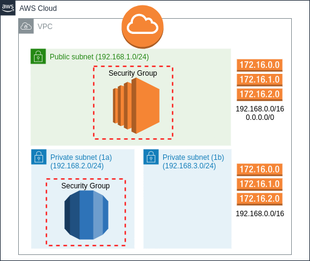

# What

This is a Terraform stack that will deploy the following architecture:


## How to run

1) install Terraform
2) clone this repo
3) create a key in AWS IAM and add those to terraform.tfvars (you need to create this file)
4) run "terraform init"
5) run "terraform apply" and wait for 5 mins

If you need the private key that was created, run "terraform output -raw private_key"

Once you're done, run "terraform destroy"

## Sample of terraform.tfvars

```
AWS_ACCESS_KEY = ""
AWS_SECRET_KEY = ""
AWS_REGION = "us-east-1"
```